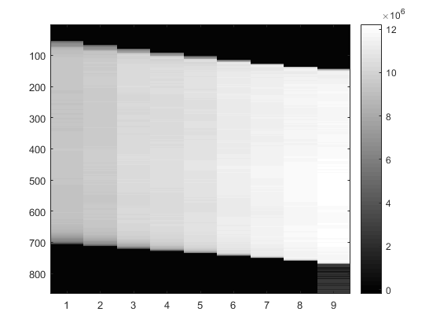

__Responsibilities__

As a PhD Graduate Research Assistant under [John
Shepherd](https://shepherdresearchlab.org/about/our-team/) PhD, I
conduct imaging research which is primarily focused on breast cancer. Our
research group seeks to discover novel imaging bio-markers to detect cancer and
asses risk.  Machine and deep learning are big components of my research as it
is a powerful tool for analyzing high dimensionality data that is images.  My
background in high performance computing and software engineering allows me to
fully leverage our GPU clusters to rapidly build and train machine learning
models.  

**Projects**

  

{{ include.page.summary }}

- [Breast Thickness Tomosynthesis](../work_extra/uhcc-ge_tomo) - Breast density
  is a biomarker that is associated with cancer risk.  Accurate point thickness
measurements of the breast are necessary for calculating density.  We use nine
views from a sinogram to solve and inverse problem and derive point thickness
measurements.   

    - I developed an unsupervised machine learning model using PCA to
      characterize sinograms resulting from breast of different thickness, widths, and densities.  
	- [Work was presented in an abstract detailed
	  __HERE__](../essays/rsna_2019)
- _[3CB](https://shepherdresearchlab.org/research/3cb/)_ - 3 Compartment Breast
  of 3CB is a project that can render breast lesions specific to the three major
components that make  up breast tissue.  These components include water, lipid,
and protein and quantifying the amount of each component helps to assess cancer
risk and need for biopsies.
    - For this project I refactored the existing 3D rendering code and plan to
      incorporate the breast thickness tomosynthesis algorithm to get accurate
thicknesses and make up of breast lesions.    
- _Interval vs Screening Cancer Detection_ - Screening cancers are cancers
  detected from a screening mammogram.  Interval cancers are a case of breast
cancers that found after a previous screening mammogram reported a negative
finding.  We use deep learning and neural networks to search for signals in
interval cancer cases to try and catch the cancers early and at the time of
screening.
    - Our group is fortunate enough to work with the largest data set of it's
      kind for this project.  I helped with high throughput preprocessing and
cleaning of our large image dataset .  I also research and explore of different
deep learning techniques and models to achieve high sensitivity and specificity
for interval cancer cases. 
