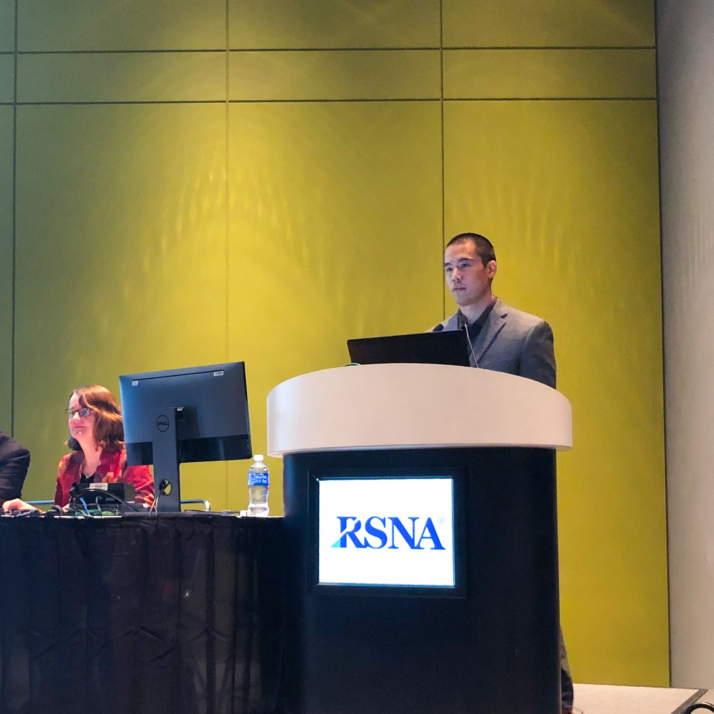
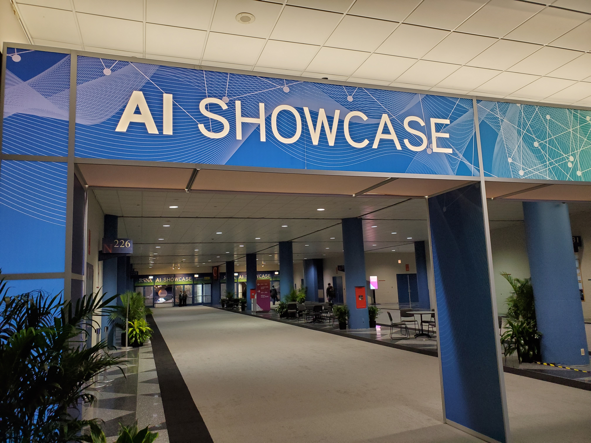

1. [__Abstract__](http://archive.rsna.org/2019/19011841.html)
2. [__Presentation__](../docs/lleong_rsna19_oral.pdf)

After joining [John Shepherd](https://shepherdresearchlab.org/about/our-team/)
and his team at the University of Hawaii Cancer Center in November of 2018, I
had begun working on a dual X-ray mammography project known as the [3 Compartment
Breast (3CB)](https://shepherdresearchlab.org/research/3cb/).  The goal of 3CB
is to be able to separately view the different tissue components of the breast
and possible lesions.  These components include lipid, water, and protein. In
order to accurately derive the three components, accurate geometrical and
thickness measurements of the breast is needed.  My work consisted of developing
a technique to accurately estimate the breast measurements that were needed for our 3CB
algorithm.

Abstracts for the Radiological Society of North America (RSNA) annual
conference were due in April and we believed that this would be a good
opportunity to present my work and for me to gain exposure to the field of
radiology.  My abstract was accepted and I was awarded an oral presentation in
the beast imaging physics session held on Monday, December 02, 2019.  After
being notified that I had been awarded an oral for RSNA 2019, I applied for the
[University of Hawaii Cancer Center's Trainee Travel
grant](https://www.uhcancercenter.org/education/students/graduate-and-postdoctoral-students?start=2).
I was fortunate to receive the maximum funding for the award.  I am
appreciative and grateful to the University of Hawaii Cancer Center for the
award because it has allowed me to gain valuable experience.

  
  

  	Entrance staircase at RSNA
  

The trip to RSNA consisted of a bunch of first for me.  It was the first time
that I had an abstract accepted, it was my first, first authored work, it was
the first time attending a conference of this scale and size, it was the first
time speaking in front of an audience of that size, and it was my first time to
Chicago.  I owe it to Dr. Shepherd and the rest of the team for helping me with
the practicing of my talk and helping me practice fielding potentially hard
questions.  I went into my talk confident and the presentation went well.  I
had receive a couple questions at the end of my presentation.  One question was
about my methodology and its application to real patients and the other
questions dealt with the scope and future direction of my work.  The questions
were reasonable, not difficult, and I was able to provide clear and concise
answers.  My talk was one of two talks with in our session that consisted of
machine learning or the use of artificial intelligence (AI).  Most of the talks were
geared more towards clinicians and techs who use and operate digital breast
tomosynthesis imaging systems.  Listen to these talks were valuable because it
offered a new perspective on work that was similar or with in the scope of my
project. 
<!--
one question on methods, how does the method apply to other imaging systems, how does my project fit into the scope of breast imaging physics
discuss how your project compared to others in session w.r.t. to topics.
	other machine learning paper
	calibration and other techniques in DBT
-->
Speaking in front of an audience of that size for the first time turned out to
be fun. I have grown from this experience and am excited and motivated to get
back to the research so that I can have another opportunity like this again.

  

  	Fielding questions at the podium
  

  

I spent time attending other speaker sessions and reviewing the poster
presentations.  Since the majority of my focus for my dissertation and research
is centered around breast imaging and the use of machine learning and AI, my
attendance was focused around those topics.  I got to learn about the work and
advanced that were being made in the field of radiology as a whole, as well as,
in the specific fields of breast imaging and AI. There were also several
workshops however, since this conference is geared heavily towards clinicians,
the AI workshops were meant to be less technical.  In any case, they were
informative since they were specific to the field of radiology.
<!--
Expand on how it is mainly a conference for clinicians and how the talks and workshops were geared towards it
-->

  
  

  	Hall to the AI specific vendor space
  

To my delightful surprise, the rest of my time at RSNA was spent in discussion with
vendors, clinicians, and existing and potential research collaborators.  I was
fortunate to be included in many conversations that took place between
clinicians, companies, and us, the researchers.  Being a part of the discourse
was a unique and valuable experience in that we get to see the impact of our
work and what work still needs to be done.  When meeting the various companies,
we get to learn about the latest and greatest technologies that are on the
market or in development.  We had many discussions with companies on how we can
initiate or further our collaborations using their products and/or helping to
develop new ones.  All companies and products that were at RSNA are the
extension of some research work done by researchers just like us and it is eye
opening to see one potential end product of our work.  Meetings with clinicians
help us to understand how our research relates to the level of patient care.
It also allows us to learn about the disparities within healthcare that our
efforts should be focused on addressing.  It is common that some research
efforts do not translate when moving from the bench top to the bedside and these
conversations with clinicians help us to identify when this is happening so that
we can work towards a solution.  Lastly, we also met with other fellow research
team to discuss our current work and the potential for collaboration.  These
conversations were valuable and they allowed me to see view the healthcare,
specifically radiology, field from many perspectives that I am not sure I would
have seen by staying on island nor in the lab.  

As a student in the Molecular Bioscience and Bioengineering department at the
University of Hawaii at Manoa and as a researcher who represents the University
of Hawaii Cancer Center, Shepherd Research Lab, and the AI Precision Health
Institute, we strive to build translational AI models targeted at helping the
people of Hawaii.  My trip to RSNA and the trainee travel grant has allowed me
to gain valuable knowledge and experience that has oriented me in a good
position to accomplish my goals.

<!--
---

The following is a short accounting and notes of meeting and iterations that took place

1. Volpara
	- We have a Volpara machine for measuring breast density screening
	- A new breast density software is being released
		- New risk scoring system
			- Tyrer Cuzick (TC8) score
			- Helps radiologist triage cases
	- contact Peter Graham

2. Hologic
	- Discussed status of current collaborative projects
		- DXA whole body and bone, Dakine study

3. Phillips
	- Spectral iQon CT system demo
		- Dual energy ct system
			- Dual detector technology
		- Great potential for body compositional research

4. General Electric
	- Updates on tomosynthesis breast project
		- Compositional and Computer-Aided Detection (CAD) study updates
	- VAT project update
	- contact Serge Muller

	- GE's dual ct system
		- Dual energy system
	- contact Mike Teramoto

5. Bilal
	- Breast ultrasound
	- Light/laser acoustic imaging
	- Potential to extend compositional breast work

6. University of Chicago Breast Researchers
	- Discussing current results for CAD composition analysis
	- Game planning to extend 3CB for detection
	- Strategizing for further funding
	- contact Maryellen Geiger and Karen Drukker

7. iCAD inc
	- Presented results on CAD and compositional breast
		- Work was done on older software
	- Discussed future work 
		- Discussed getting new versions for software to continue
		  analysis
			- Tomo 3D software
	- contact Senthil , Jeff , Johnathan , Jennifer

8. Quibim
	- Medical AI platform
	- Angle (owner and CEO)  gave talked at University of Hawaii Cancer
	  Center
	
9. Artesy
	- AI market place
		- Like youtube for testing and deploying medical AI models
	- Potential place to host and test our developed models

10. Nividia
	- We have 2 of their most powerful AI machines (DGX-1)
	- Discussed new products that are supported by our machines
		- Clara - medical AI platform
		- Data curration with XNAT
		- Federated learning potentials

11. Zebra
	- 4 FDA approved AI algorithms
	- Fracture risk
		- Potential collaboration

-->
__MORE TO COME, STAY TUNED!__

 
