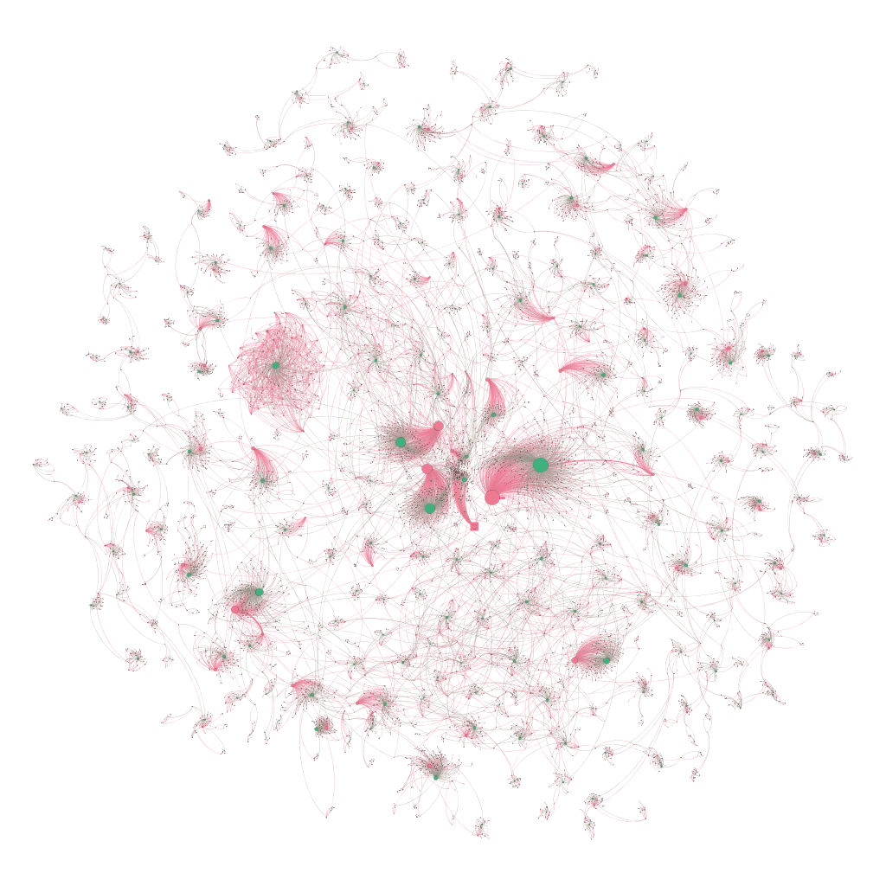

---
__Support future research__

  

<!--a class="ui large orange image label">
  
	BTC address:
  

       1MU21L4Niyss1HoPeaYgkNT8vn5meJrYeD 
  

</a-->

  

       btc address: 1MU21L4Niyss1HoPeaYgkNT8vn5meJrYeD 
   

---
<a href="#webv">__Web Version of Write Up HERE__</a>

---

__Summary__

In late 2017 Bitcoin, btc, was gaining popularity as the major cryptocurrency
and many began to acquire and exchanges the cryptocurrency.  One of the draws
of btc and other cryptocurrencies is the anonymity that is afforded to the
those involved in transactions.  While all transactions are public and recorded
on the blockchain only addresses and accounts are visible.  Peoples identities
can be detracted from a particular address.  In addition, wallets allowed users
to generate new addresses at, virtually, any time.  

<ins class="adsbygoogle"
     style="display:block; text-align:center;"
     data-ad-layout="in-article"
     data-ad-format="fluid"
     data-ad-client="ca-pub-4379410432613892"
     data-ad-slot="8398952705"></ins>

During this period, in 2016, sources claimed that the number of btc users was
growing exponentially.  This trend was also extrapolated to the number of btc
transaction that occurred on the blockchain.  However, during this time btc was
still not respected as an actual currency and it was difficult to exchange it
like money.  As a result we expected to see many users but few interactions
between them.  In this project I took snap shots of the blockchain and
performed network analyses to characterize the network, behavior, and explore
hypotheses and claims made about the network.

**Contributions**

<table class="ui fluid large floated left image">
<caption align="bottom">Power-law analysis looking for scale free networks with igraph and R.
</caption>
<tr><td></td></tr>
</table>

Using a websocket API provided by
[Blockchain.info](https://www.blockchain.com/api) I was able to sample
blockchain transaction data which included, sender/receiver addresses, amount,
hash difficulty, etc.  I was only concerned with the sender, receiver, and the
amount of btc sent.  I took three samples of the network which included a one,
two, and six hour sample.  The data, containing a little over 13,000 records
was parsed and converted into a .graphml file for analysis.  Using the igraph
package with R I looked at the following network characteristics, transitivity,
average degree, average distance, reciprocity, degree distribution, and maximal
cliques.  In addition, on the largest network, I evaluated community
structures.

<!--figure>

  
  <caption alight="bottom">caption</caption>
  <figcaption>This is the figure caption</figcaption>

</figure-->

<table class="ui fluid large floated right image">
<caption align="bottom">Two biggest community structures visualized using Gephi
</caption>
<tr><td></td></tr>
</table>

The graph file was then ported over to [Gephi](https://gephi.org/) mainly for
visualization purposes.  Network analysis was also performed with Gephi because
previous experiences taught me that Gephi metrics vary slightly from those
gather by igraph.  Gephi and igraph sometimes, for certain network metrics,
utilize slightly different algorithms and thus, different values result.  Gephi
helped with the visualization of influential players in the network as well as
community structures.

<ins class="adsbygoogle"
     style="display:block; text-align:center;"
     data-ad-layout="in-article"
     data-ad-format="fluid"
     data-ad-client="ca-pub-4379410432613892"
     data-ad-slot="8398952705"></ins>

__Learned__

From my work on this project I was able to analyze the btc network and
characterize it.  More importantly, I was able to develop skills in working
with API's, parsing large data, analyzing that data, and presenting it with
visual aids such as igraph and Gephi.  These skills are applicable in many
other situations that require the gathering, analysis, and
presentation/visualization of large amounts of data.  R is a powerful
statistics tool and I foresee my skills with it being useful in my pursuit
toward data driven research.  Networks are ever present and being able to
recognize and analyze them is an important skill.  

[__Write Up found HERE__](../docs/lleong_snapshot_samplings_of_the_bitcoin_transaction_network.pdf)
 

---
---
<a id="webv">__WEB VERSION__</a>

<h3>Abstract</h3>

The purpose of this work was to perform a network
analysis on the rapidly growing bitcoin transaction network. Using a
web-socket API, we collected data on all transactions occurring during
a six hour window. Sender and receiver addresses as well as the
amount of bitcoin exchanged were record. Graphs were generated,
using R and Gephi, in which nodes represent addresses and edges
represent the exchange of bitcoin. The six hour data set was
subsetted into a one and two hour sampling snapshot of the
network. We performed comparisons and analysis on all subsets
of the data in an effort to determine the minimum sampling
length that represented the network as a whole. Our results
suggest that the six hour sampling was the minimum limit with
respect to sampling time needed to accurately characterize the
bitcoin transaction network.Anonymity is a desired feature of the
blockchain and bitcoin network however, it limited us in our
analysis and conclusions we drew from our results were mostly
inferred. Future work is needed and being done to gather more
comprehensive data so that the bitcoin transaction network can be
better analyzed.

  <h3 class="sectionHead">1     Introduction</h3>
The
invention of the internet has helped to provide a new platform for the exchange
of money by providing the framework to connect individuals from all around the
world. Most monetary exchanges over the internet occur with the help of third
party entities such as banks or credit card companies. These third party
entities often have oversight over all transactions and are responsible for
verifying the integrity of transactions&#x00A0;[<a href="#Xmoney">12</a>].
Exchange protocols, which require a verifier, have become the conventional
method of exchanging money over the internet. While these conventional exchange
methods account for a good amount of the daily transactions around the world,
there are a few draw backs that present problems to many users. Third party
verifiers constantly receive a high volume of transactions which need to be
verified before money is permanently moved from one individual to another.
Different companies and banks have different methods of      prioritizing the
order in which transactions are verified. A high number of transactions
verifications by a small number of third parity entities leads to a
bottle-necking effect which can leave recipients waiting for payments to clear
and be received. In an effort to reduce the volume of transactions many third
party verifiers require minimum transactions amounts and, in some cases, a
small transaction fee. While this may help to mitigate the volume of
transactions that need to be verified, it limits the financial freedom of those
who participate in conventional exchange methods.  

<!--l. 26-->
    Bitcoin (BTC) is a cryptocurrency that offered a solution
to the shortcomings present in conventional exchange methods. Invented by
Satoshi Nakamoto, bitcoin is a peer-to-peer payment system in which payments
are validated by math rather than trust&#x00A0;[<a href="#Xbitcoin">9</a>]. In
other words, instead of trusting a potentially nefarious third party entity,
transactions are verified by a proof of work algorithm which involves block
hashing&#x00A0;[<a href="#Xbitcoin">9</a>,<a href="#Xqa_btc_graph">11</a>]. A
public ledger, known as the blockchain, is created as a result of the hashing
algorithm and it contains every transaction in the history of the network. New
blocks are hashed about every 10 minutes and transactions are verified and
added to the ledger indicating a successful transfer of bitcoin from one
individual or entity to another&#x00A0;[<a href="#Xbitcoin">9</a>]. Anonymity
is preserved by keeping user addresses separate and abstracted away from
personal information. In addition, there are some instances where a particular
user's wallet can generate new sending and receiving addresses to further
maintain a level of anonymity&#x00A0;[<a href="#Xandreas">2</a>,&#x00A0;<a
href="#Xbitcoin">9</a>].  

<ins class="adsbygoogle"
     style="display:block; text-align:center;"
     data-ad-layout="in-article"
     data-ad-format="fluid"
     data-ad-client="ca-pub-4379410432613892"
     data-ad-slot="8398952705"></ins>

<!--l. 43-->
    Since its genesis,
bitcoin has gained popularity and traction. As a result, the number of bitcoin
addresses and the number of transactions have continued to increase at an
exponential rate as seen in Figures&#x00A0;<a
href="#x1-1003r2">2<!--tex4ht:ref: fig:btc_info --></a>.  In this paper, we
analyze different snapshots of the growing bitcoin network. Since the bitcoin
network is currently large and continuously growing, we are interested in
investigating the appropriate network sampling time frame. Network and graph
analysis have been performed on the bitcoin network however, its rapid growth
may indicate a need for a better way of characterizing the network at a
specific point in time&#x00A0;[<a href="#Xgraph_ana_btc">6</a>].  Determining a
sampling criterion would allow analysis to be done on a smaller sub-graph from
which, conclusions can be drawn and extrapolated to the network as a whole.
Running a network analysis on a representative sub-graph would be more efficient
and computationally favorable than the whole, growing, bitcoin network.  <!--l.
59-->
    

<!--l. 62-->
<!--l. 64-->
 

 
 Number  of
transactions  over  time  grows  as  an  exponential function <!--l. 71-->
 
 
Number of
unique Bitcoin addresses growth over time   
Figure&#x00A0;2:  Growth  in  the  number  of  transactions  and  unique
addresses imply the growth in bitcoin users and
popularity
<!--tex4ht:label?: x1-1003r2 -->

<!--l. 78-->
  
 <!--l. 81-->
  The remainder of the papers is as follows: in
Section&#x00A0;<a href="#x1-20002">2<!--tex4ht:ref: sec:methods --></a> we
describe how data is collected, how we generate graphs from that data, and how
we use specific tools to analyses the network. In Section&#x00A0;<a
href="#x1-60003">3<!--tex4ht:ref: sec:results --></a> we report our finding at
different sampling intervals. Lastly, we discuss our findings and conclusion in
Section&#x00A0;<a href="#x1-90004">4<!--tex4ht:ref: sec:conclusion --></a>.
<h3 class="sectionHead">2      Methods</h3>
<!--l. 5-->
BTCs are constantly being exchanged and moving throughout the
network and as a result the numbers of transactions are ever growing.
The number of users and addresses are also constantly increasing.
Every transaction involving BTC is public and every transaction since
BTCs inception in 2009 is recorded on a public ledger. This is a unique
feature of BTC and every node participating in the network
has a copy of this public ledger. This ledger is constantly being
updated as new transactions are confirmed. Updates occur on every
ledger on every node participating in the network and thus every
node is in consensus with each other on the current status of the
ledger.
<!--l. 15-->
2.1     Data Collection.
<!--l. 17-->
  While we could have joined the blockchain network and downloaded a
copy of the public ledger to build our network graph, we felt that it
would not be an efficient method of evaluating the current status of the
BTC network. As a result, we decided to utilize a web socket
API from BlockChain.Info. This API allowed us to stream live
transactions as they were on their way to be confirmed. Each
transaction came in as a JavaScript Object Notation (JSON) file and a
script was written to extract and parse out the sender address,
receiver address, and the BTC amount variables. These variables
were stored as a comma separated file (.csv). The web socket ran
for a total of six hours and separate csv files were generated
at the one hour, two hour, and six hour time points; hence the
snapshots. One of our objectives was to investigate possible
changes in network characteristics with different sample sizes
and durations. In other words, we are interested to see if any
network metrics change as the network grows within our sampling
snapshots. It is important to note that the web socket performed a
continuous data collection and was not interrupted when the
one hour and two hour samples were taken. The resulting one
hour and two hour samples are sub sets of the six hour sample
with the one hour sample also being a subset of the two hour
sample.

<ins class="adsbygoogle"
     style="display:block; text-align:center;"
     data-ad-layout="in-article"
     data-ad-format="fluid"
     data-ad-client="ca-pub-4379410432613892"
     data-ad-slot="8398952705"></ins>

<!--l. 36-->
2.2     Graph Generation.
<!--l. 38-->
  The csv files for the one, two, and six hour samplings were
imported into Gephi&#x00A0;[<a
href="#Xgephi">4</a>] to generate a graph of the sampled BTC
network. The csv files were imported as edge list where the sending
address corresponded to the "source" and the receiving address
corresponded to the "target". The amount was converted from Satoshis
to BTCs, 1 BTC = 1x108 Satoshi, and stored as a float, an edge
attribute. Graph files were exported as .graphml for further data
processing.
<!--l. 46-->
2.3     Network Analysis.                                   <!--l. 48-->
    Graph metrics were analyzed with R utilizing the igraph,
     poweRlaw, and linkcomm packages&#x00A0;[<a
href="#Xigraph">5</a>]. Transitivity, average
     degree, average distance, reciprocity, degree distribution, and
     maximal cliques were measured for each snapshot graph and
     compared to each other. The largest connected components were also
     extracted from each of the three sample graphs and metrics were
     computed with igraph. The six hour connected graph was further
     evaluated for the presence of communities. Using the linkcomm
     package and the getlinkcommunities, by Alex T. Kalinka, we
     were able to generate community's nodes that linked to every
     node of a particular community&#x00A0;[<a
href="#Xigraph">5</a>]. Investigating community
     structures in the giant connected component may reveal BTC user
     financial behavior; in particular who exchanges money with
     whom.
          <h3 class="sectionHead">3     Results</h3>
     <!--l. 4-->
There was a positive correlation between the sampling time and the
     amount of observed transactions. As mentioned previously in
     Section&#x00A0;<a
href="#x1-10001">1<!--tex4ht:ref: sec:intro --></a>, the numbers of transactions are increasing at an exponential
     rate. We plotted the number of edges, obtained in our sampling, over
     the duration of six hours. Transactions are indicated by an edge
     in the resulting graph of the networks sampled for one, two,
     and six hours. The increase or growth of the network resulted
     in an increase in both the number of transactions, indicated
     by the number of edges, and the number of active addresses,
     indicated by the number of nodes. These results are shown in
     Figure&#x00A0;<a
href="#x1-6001r3">3<!--tex4ht:ref: fig:sampling --></a>.
     <!--l. 15-->
    

<!--l. 17-->

  
Figure&#x00A0;3: As we take longer samples, the network grows. Nodes
(BLUE)  indicate  new  addresses,  and  edges  (RED)  indicates  new
transactions. R2  values for best fit lines for nodes and edges are
0.997 and 0.996 respectively
<!--tex4ht:label?: x1-6001r3 -->

<!--l. 22-->
  

<!--l. 25-->
  The trend line would indicate that the number of transactions are
growing at a logarithmic pace rather than an exponential one. R2
values for logarithmic best fit lines for nodes and edges are 0.997 and
0.996 respectively This is contradictory to what was expected however,
this discrepancy may be due to the amount of data and sample size.
Blockchain.info reports an exponential growth in the number of
transactions over the whole life span of BTC&#x00A0;[<a
href="#Xblockchain.com">1</a>]. Our sampling
window could be the limiting factor and perhaps, we would
start to see an exponential growth trend for a longer sampling
duration.
<!--l. 35-->
  The number of transactions since the inception of BTC has an
overall general exponential growth trend but the transaction rate
seems to fluctuate if observed form the perspective of weeks and
months. There is a level of volatility when it comes to the prices or
exchange rate of BTC&#x00A0;[<a
href="#Xecon">13</a>]. Price volatility could correlate to these
fluctuations and periods of lower transaction volumes. A six hour
sampling window does not appear to be a long enough time frame to
model the overall network growth. Since transactions rates can
fluctuate for periods of time ranging from days to months, it is best to
look at the entire transaction history in order to draw conclusions
about the overall growth rate of transactions. A smaller sampling
window, such as the 6 hours for which we took our samples, may be
useful when analyzing how the network is growing in the near or short
term.
<!--l. 48-->
3.1     Snapshot Network Analysis Results and Comparisons.
<!--l. 50-->
  Network analysis was performed on all three graphs with the
purpose of investigating changes as the time and the size of the sample
network increased as well as for comparison to previously reported
findings. Analyzing the difference in resulting graph metrics would
help in determining an appropriate sampling window that would yield
a sample graph that is representative of the network as a whole.
Table&#x00A0;<a
href="#x1-7001r1">1<!--tex4ht:ref: tab:data_count --></a> contains the metrics calculated for all three network
graphs.

<!--l. 59-->
  

 
Table&#x00A0;1:  Graph  metrics  for  one,  two,  and  six  our  sampling
snapshots calculated using igraph and R
<!--tex4ht:label?: x1-7001r1 -->
 <!--tex4ht:inline-->

<table id="TBL-1" class="tabular"
cellspacing="0" cellpadding="0"  
><colgroup id="TBL-1-1g"><col
id="TBL-1-1"></colgroup><colgroup id="TBL-1-2g"><col
id="TBL-1-2"><col
id="TBL-1-3"><col
id="TBL-1-4"></colgroup><tr  
 style="vertical-align:baseline;" id="TBL-1-1-"><td  style="white-space:nowrap; text-align:center;" id="TBL-1-1-1"  
class="td11"> Sampling Duration  </td><td  style="white-space:nowrap; text-align:left;" id="TBL-1-1-2"  
class="td11">1 Hour</td><td  style="white-space:nowrap; text-align:center;" id="TBL-1-1-3"  
class="td11">2 Hour</td><td  style="white-space:nowrap; text-align:right;" id="TBL-1-1-4"  
class="td11">6 Hour</td>
</tr><tr
class="hline"><td>
</td><td>
</td><td>
</td><td>
</td></tr><tr
class="hline"><td>
</td><td>
</td><td>
</td><td>
</td></tr><tr  
 style="vertical-align:baseline;" id="TBL-1-2-"><td  style="white-space:nowrap; text-align:center;" id="TBL-1-2-1"  
class="td11">      Nodes            </td><td  style="white-space:nowrap; text-align:left;" id="TBL-1-2-2"  
class="td11">18654  </td><td  style="white-space:nowrap; text-align:center;" id="TBL-1-2-3"  
class="td11"> 52312 </td><td  style="white-space:nowrap; text-align:right;" id="TBL-1-2-4"  
class="td11"> 95209</td></tr><tr  
 style="vertical-align:baseline;" id="TBL-1-3-"><td  style="white-space:nowrap; text-align:center;" id="TBL-1-3-1"  
class="td11"> Edges </td> <td  style="white-space:nowrap; text-align:left;" id="TBL-1-3-2"  
class="td11">11262 </td> <td  style="white-space:nowrap; text-align:center;" id="TBL-1-3-3"  
class="td11"> 33408 </td> <td  style="white-space:nowrap; text-align:right;" id="TBL-1-3-4"  
class="td11"> 62635</td>
</tr><tr  
 style="vertical-align:baseline;" id="TBL-1-4-"><td  style="white-space:nowrap; text-align:center;" id="TBL-1-4-1"  
class="td11">     Diameter          </td><td  style="white-space:nowrap; text-align:left;" id="TBL-1-4-2"  
class="td11">12        </td><td  style="white-space:nowrap; text-align:center;" id="TBL-1-4-3"  
class="td11">  19    </td><td  style="white-space:nowrap; text-align:right;" id="TBL-1-4-4"  
class="td11">    39</td></tr><tr  
 style="vertical-align:baseline;" id="TBL-1-5-"><td  style="white-space:nowrap; text-align:center;" id="TBL-1-5-1"  
class="td11"> Max Cliques </td> <td  style="white-space:nowrap; text-align:left;" id="TBL-1-5-2"  
class="td11">3 </td> <td  style="white-space:nowrap; text-align:center;" id="TBL-1-5-3"  
class="td11"> 3 </td> <td  style="white-space:nowrap; text-align:right;" id="TBL-1-5-4"  
class="td11"> 3</td>
</tr><tr  
 style="vertical-align:baseline;" id="TBL-1-6-"><td  style="white-space:nowrap; text-align:center;" id="TBL-1-6-1"  
class="td11">      Dyads            </td><td  style="white-space:nowrap; text-align:left;" id="TBL-1-6-2"  
class="td11">10943  </td><td  style="white-space:nowrap; text-align:center;" id="TBL-1-6-3"  
class="td11"> 32512 </td><td  style="white-space:nowrap; text-align:right;" id="TBL-1-6-4"  
class="td11"> 61122</td>
</tr><tr  
 style="vertical-align:baseline;" id="TBL-1-7-"><td  style="white-space:nowrap; text-align:center;" id="TBL-1-7-1"  
class="td11">      Tryads            </td><td  style="white-space:nowrap; text-align:left;" id="TBL-1-7-2"  
class="td11">2          </td><td  style="white-space:nowrap; text-align:center;" id="TBL-1-7-3"  
class="td11">  8     </td><td  style="white-space:nowrap; text-align:right;" id="TBL-1-7-4"  
class="td11">    34</td>
</tr><tr
class="hline"><td>
</td><td>
</td><td>
</td><td>
</td></tr><tr  
 style="vertical-align:baseline;" id="TBL-1-8-"><td  style="white-space:nowrap; text-align:center;" id="TBL-1-8-1"  
class="td11">    Reciprocity        </td><td  style="white-space:nowrap; text-align:left;" id="TBL-1-8-2"  
class="td11">0.00     </td><td  style="white-space:nowrap; text-align:center;" id="TBL-1-8-3"  
class="td11"> 0.00  </td><td  style="white-space:nowrap; text-align:right;" id="TBL-1-8-4"  
class="td11">  0.00</td>
</tr><tr  
 style="vertical-align:baseline;" id="TBL-1-9-"><td  style="white-space:nowrap; text-align:center;" id="TBL-1-9-1"  
class="td11"> Transitivity (global) </td><td  style="white-space:nowrap; text-align:left;" id="TBL-1-9-2"  
class="td11">0.00     </td><td  style="white-space:nowrap; text-align:center;" id="TBL-1-9-3"  
class="td11"> 0.00  </td><td  style="white-space:nowrap; text-align:right;" id="TBL-1-9-4"  
class="td11">  0.00</td>
</tr><tr  
 style="vertical-align:baseline;" id="TBL-1-10-"><td  style="white-space:nowrap; text-align:center;" id="TBL-1-10-1"  
class="td11">Transitivity (average)</td><td  style="white-space:nowrap; text-align:left;" id="TBL-1-10-2"  
class="td11">0.00     </td><td  style="white-space:nowrap; text-align:center;" id="TBL-1-10-3"  
class="td11"> 0.00  </td><td  style="white-space:nowrap; text-align:right;" id="TBL-1-10-4"  
class="td11">  0.00</td>
</tr><tr  
 style="vertical-align:baseline;" id="TBL-1-11-"><td  style="white-space:nowrap; text-align:center;" id="TBL-1-11-1"  
class="td11">   Mean Degree       </td><td  style="white-space:nowrap; text-align:left;" id="TBL-1-11-2"  
class="td11">1.21     </td><td  style="white-space:nowrap; text-align:center;" id="TBL-1-11-3"  
class="td11"> 1.28  </td><td  style="white-space:nowrap; text-align:right;" id="TBL-1-11-4"  
class="td11">  1.32</td>
</tr><tr  
 style="vertical-align:baseline;" id="TBL-1-12-"><td  style="white-space:nowrap; text-align:center;" id="TBL-1-12-1"  
class="td11">   Mean Distance     </td><td  style="white-space:nowrap; text-align:left;" id="TBL-1-12-2"  
class="td11">1.31     </td><td  style="white-space:nowrap; text-align:center;" id="TBL-1-12-3"  
class="td11"> 1.90  </td><td  style="white-space:nowrap; text-align:right;" id="TBL-1-12-4"  
class="td11">  5.37</td>
</tr><tr  
 style="vertical-align:baseline;" id="TBL-1-13-"><td  style="white-space:nowrap; text-align:center;" id="TBL-1-13-1"  
class="td11">                  </td></tr></table>                                  

  

<!--l. 89-->
  

<!--l. 94-->
 
Graph sampling after one hour
 
Graph sampling after two hours
 
Graph sampling after six hours
 
Figure&#x00A0;5: Visualizations of one, two, and six hour sample graphs, from left to right. Graph density increases as collection time increases
<!--tex4ht:label?: x1-7005r5 -->

  

<!--l. 119-->
  

  
Figure&#x00A0;6: Log-Log degree distribution of one, two, and six hour networks, from left to right. 
<!--tex4ht:label?: x1-7006r6 -->

  

<!--l. 125-->
  Across all three sample graphs, reciprocity, global transitivity, and
mean degree were consistent. These metrics changed only slightly as
the graph grew over the 6 hours. Transitivity was low for all three
graphs, which was to be expected. Transitivity would increase when,
for example, someone sent BTC to two separate people and those two
people exchanged BTC with each other. This is not a likely event and
this is why we expected it to be low. All three graphs had a low mean
degree with the largest mean degree value being 1.32 for the six
hour sample graph. A low mean degree would help to explain
a low transitivity since a low mean degree indicates that the
majority of the nodes in a graph have only one edge. Nodes need a
minimum of two edges for transitivity. The mean degree values
for each graph indicate that most addresses execute only one
transaction. The number of dyads implies that the graph is primarily
composed of pairs of nodes that share only one edge. For each
sample graph, dyads account for the majority of nodes in the
network. Triads make up a significantly lesser portion of the
graph. We did not expect to see many triads or cliques during our
sampling. In the short term, it is unlikely that triads form because it
would mean that some money comes back to the original sender
implying that some portion of that transaction should not have been
sent out in the first place. However, goods or services could
have been exchanged among the triad which would explain its
formation. The network is built only on BTC transactions and thus
we do not know the exact motive behind each transaction. A
longer sampling would probably have led to more triads and
possibly greater maximal cliques. However, it is just as likely that
the number of pairs of nodes would have increased at a similar
rate.

<ins class="adsbygoogle"
     style="display:block; text-align:center;"
     data-ad-layout="in-article"
     data-ad-format="fluid"
     data-ad-client="ca-pub-4379410432613892"
     data-ad-slot="8398952705"></ins>

<!--l. 151-->
  Reciprocity was also low. This was expected for this type of
network. It is unlikely that a node would reciprocate an edge because
that would be like person A sending 1 BTC to person B in the first
transaction then person B sending back, to person A, a given amount
of BTC in a second transaction. The first and second transaction can be
combined into one and the net amount, the difference in the
amount between the first and second transaction, should be sent to
the appropriate person which would eliminate an edge in one
direction. The reciprocity value is small for all graphs but it is not
zero which means that there are instance of reciprocating edges.
The instances where a user sends the wrong amount to another
user who, is kind enough to correct the transaction and send it
back to the person it originated from may be an instance for
reciprocation. Returning goods and getting a refund on something
bought with BTC is another instance that may warrant reciprocation.
Reciprocation can also be the result of gambling sites where,
gamblers gamble in BTC and earn their winnings in BTC too.
These instances are rare and small in comparison to the vast
number of transactions constantly being received. The rarity of
reciprocity is reflected in the zero value obtained for all sample
graphs.
<!--l. 170-->
  Visual representations of each samples size graph, density,
and connections are show in Figure&#x00A0;<a
href="#x1-7005r5">5<!--tex4ht:ref: fig:graphs --></a>. The density of the graph
increase as sampling time increases. Dark black spots are star like
structures consisting of clusters of nods around a single node
with a high degree. As time goes on, more nodes form edges to
these central nodes which increase the size of the black spots.          However, it does not appear that links are formed from one high
     degree node to another. Nodes with high degree seem to increase
     their degree as more nodes join the network which exhibits
     characteristics of preferential attachment and implies a possible scale
     free network&#x00A0;[<a
href="#Xbarabasi">3</a>,&#x00A0;<a
href="#Xrich">7</a>].

<!--l. 180-->
  

  
Figure&#x00A0;7: Lin-Lin degree distribution of one, two, and six hour networks, from left to right.
<!--tex4ht:label?: x1-7007r7 -->

  

<!--l. 186-->
  

  
Figure&#x00A0;8: Plot of one, two, and six hour network degree distributions with exponential(Red), log normal(Green), power-law(Blue), and
Poisson(Orange) best fit lines, from left to right. 
<!--tex4ht:label?: x1-7008r8 -->

  

<!--l. 192-->
  Scale free networks are characterized by having a power-law degree
distribution. We investigated the degree distribution in Figure&#x00A0;<a
href="#x1-7007r7">7<!--tex4ht:ref: fig:powerlaw2 --></a>. Here
we see that the degree distribution for all sample networks is
heavily tailed to the right which is characteristic of power-law
distributions.
<!--l. 198-->
  The degree distributions for each graph was plotted in conjunction
with exponential, log normal, power law, and Poisson best fit lines.
Results in Figure&#x00A0;<a
href="#x1-7008r8">8<!--tex4ht:ref: fig:degree_dist --></a> would indicate that the one hour and two hour
graphs do not fit any particular trend. However, when Xmin was set at
4, the six hour distribution seemed to fit the power law distribution.
Kolmogorov-Smirnov test results in a p value of 0.46 which indicates
that we cannot reject the hypothesis that the six hour distribution fits a
power law&#x00A0;[<a
href="#Xigraph">5</a>].
<!--l. 207-->
  Evidence of a power law distribution were seen in our largest graph
which was sampled for the longest period of time. It would appear that
smaller samplings of the network do not resemble a scale-free network
however, the largest sampling started to show evidence of a power law
distribution which is indicative of a scale-free network. It is likely that
a longer sampling window would yield a larger graph in which a
power law is more apparent.

<!--l. 214-->
  Although the graphs are mainly composed of pairs of nodes, we
were interested in the presence of communities. We extracted the
largest connected component from the sample graphs. This left us with
graphs that excluded the many isolated pairs of nodes. Metrics were
calculated and are shown in Table&#x00A0;<a
href="#x1-7009r2">2<!--tex4ht:ref: tab:data_count2 --></a>.

<!--l. 219-->
  

 
Table&#x00A0;2: Graph metrics for giant component subgraph calculated
using igrap
<!--tex4ht:label?: x1-7009r2 -->
 <!--tex4ht:inline-->

<table id="TBL-2" class="tabular"
cellspacing="0" cellpadding="0"  
><colgroup id="TBL-2-1g"><col
id="TBL-2-1"></colgroup><colgroup id="TBL-2-2g"><col
id="TBL-2-2"><col
id="TBL-2-3"><col
id="TBL-2-4"></colgroup><tr  
 style="vertical-align:baseline;" id="TBL-2-1-"><td  style="white-space:nowrap; text-align:center;" id="TBL-2-1-1"  
class="td11"><!--tex4ht:inline-->
 <table id="TBL-3" class="tabular"
cellspacing="0" cellpadding="0"  
><colgroup id="TBL-3-1g"><col
id="TBL-3-1"></colgroup><tr  
 style="vertical-align:baseline;" id="TBL-3-1-"><td  style="white-space:nowrap; text-align:center;" id="TBL-3-1-1"  
class="td00">Connect Component</td></tr><tr  
 style="vertical-align:baseline;" id="TBL-3-2-"><td  style="white-space:nowrap; text-align:center;" id="TBL-3-2-1"  
class="td00"> Sampling Duration</td></tr></table>                                                                    
</td><td  style="white-space:nowrap; text-align:left;" id="TBL-2-1-2"  
class="td11">1 Hour</td><td  style="white-space:nowrap; text-align:center;" id="TBL-2-1-3"  
class="td11">2 Hour</td><td  style="white-space:nowrap; text-align:right;" id="TBL-2-1-4"  
class="td11">6 Hour</td>
</tr><tr
class="hline"><td>
</td><td>
</td><td>
</td><td>
</td></tr><tr
class="hline"><td>
</td><td>
</td><td>
</td><td>
</td></tr><tr  
 style="vertical-align:baseline;" id="TBL-2-2-"><td  style="white-space:nowrap; text-align:center;" id="TBL-2-2-1"  
class="td11">                        Nodes                                                 </td><td  style="white-space:nowrap; text-align:left;" id="TBL-2-2-2"  
class="td11">238      </td><td  style="white-space:nowrap; text-align:center;" id="TBL-2-2-3"  
class="td11"> 3028  </td><td  style="white-space:nowrap; text-align:right;" id="TBL-2-2-4"  
class="td11">  9052</td></tr><tr  
 style="vertical-align:baseline;" id="TBL-2-3-"><td  style="white-space:nowrap; text-align:center;" id="TBL-2-3-1"  
class="td11"> Edges </td> <td  style="white-space:nowrap; text-align:left;" id="TBL-2-3-2"  
class="td11">243 </td> <td  style="white-space:nowrap; text-align:center;" id="TBL-2-3-3"  
class="td11"> 3193 </td> <td  style="white-space:nowrap; text-align:right;" id="TBL-2-3-4"  
class="td11"> 9698</td>
</tr><tr  
 style="vertical-align:baseline;" id="TBL-2-4-"><td  style="white-space:nowrap; text-align:center;" id="TBL-2-4-1"  
class="td11">                       Diameter                                              </td><td  style="white-space:nowrap; text-align:left;" id="TBL-2-4-2"  
class="td11">4          </td><td  style="white-space:nowrap; text-align:center;" id="TBL-2-4-3"  
class="td11">  19    </td><td  style="white-space:nowrap; text-align:right;" id="TBL-2-4-4"  
class="td11">    39</td></tr><tr  
 style="vertical-align:baseline;" id="TBL-2-5-"><td  style="white-space:nowrap; text-align:center;" id="TBL-2-5-1"  
class="td11"> Max Cliques </td> <td  style="white-space:nowrap; text-align:left;" id="TBL-2-5-2"  
class="td11">2 </td> <td  style="white-space:nowrap; text-align:center;" id="TBL-2-5-3"  
class="td11"> 3 </td> <td  style="white-space:nowrap; text-align:right;" id="TBL-2-5-4"  
class="td11"> 3</td>
</tr><tr  
 style="vertical-align:baseline;" id="TBL-2-6-"><td  style="white-space:nowrap; text-align:center;" id="TBL-2-6-1"  
class="td11">                        Dyads                                                 </td><td  style="white-space:nowrap; text-align:left;" id="TBL-2-6-2"  
class="td11">2          </td><td  style="white-space:nowrap; text-align:center;" id="TBL-2-6-3"  
class="td11"> 3172  </td><td  style="white-space:nowrap; text-align:right;" id="TBL-2-6-4"  
class="td11">  9582</td>
</tr><tr  
 style="vertical-align:baseline;" id="TBL-2-7-"><td  style="white-space:nowrap; text-align:center;" id="TBL-2-7-1"  
class="td11">                        Tryads                                                </td><td  style="white-space:nowrap; text-align:left;" id="TBL-2-7-2"  
class="td11">0          </td><td  style="white-space:nowrap; text-align:center;" id="TBL-2-7-3"  
class="td11">  3     </td><td  style="white-space:nowrap; text-align:right;" id="TBL-2-7-4"  
class="td11">    20</td>
</tr><tr
class="hline"><td>
</td><td>
</td><td>
</td><td>
</td></tr><tr  
 style="vertical-align:baseline;" id="TBL-2-8-"><td  style="white-space:nowrap; text-align:center;" id="TBL-2-8-1"  
class="td11">                      Reciprocity                                             </td><td  style="white-space:nowrap; text-align:left;" id="TBL-2-8-2"  
class="td11">0.00     </td><td  style="white-space:nowrap; text-align:center;" id="TBL-2-8-3"  
class="td11"> 0.00  </td><td  style="white-space:nowrap; text-align:right;" id="TBL-2-8-4"  
class="td11">  0.00</td>
</tr><tr  
 style="vertical-align:baseline;" id="TBL-2-9-"><td  style="white-space:nowrap; text-align:center;" id="TBL-2-9-1"  
class="td11">                   Transitivity (global)                                      </td><td  style="white-space:nowrap; text-align:left;" id="TBL-2-9-2"  
class="td11">0.00     </td><td  style="white-space:nowrap; text-align:center;" id="TBL-2-9-3"  
class="td11"> 0.00  </td><td  style="white-space:nowrap; text-align:right;" id="TBL-2-9-4"  
class="td11">  0.00</td>
</tr><tr  
 style="vertical-align:baseline;" id="TBL-2-10-"><td  style="white-space:nowrap; text-align:center;" id="TBL-2-10-1"  
class="td11">                  Transitivity (average)                                    </td><td  style="white-space:nowrap; text-align:left;" id="TBL-2-10-2"  
class="td11">0.00     </td><td  style="white-space:nowrap; text-align:center;" id="TBL-2-10-3"  
class="td11"> 0.00  </td><td  style="white-space:nowrap; text-align:right;" id="TBL-2-10-4"  
class="td11">  0.01</td>
</tr><tr  
 style="vertical-align:baseline;" id="TBL-2-11-"><td  style="white-space:nowrap; text-align:center;" id="TBL-2-11-1"  
class="td11">                      Mean Degree                                           </td><td  style="white-space:nowrap; text-align:left;" id="TBL-2-11-2"  
class="td11">2.04     </td><td  style="white-space:nowrap; text-align:center;" id="TBL-2-11-3"  
class="td11"> 2.11  </td><td  style="white-space:nowrap; text-align:right;" id="TBL-2-11-4"  
class="td11">  2.14</td>
</tr><tr  
 style="vertical-align:baseline;" id="TBL-2-12-"><td  style="white-space:nowrap; text-align:center;" id="TBL-2-12-1"  
class="td11">                     Mean Distance                                          </td><td  style="white-space:nowrap; text-align:left;" id="TBL-2-12-2"  
class="td11">1.29     </td><td  style="white-space:nowrap; text-align:center;" id="TBL-2-12-3"  
class="td11"> 3.04  </td><td  style="white-space:nowrap; text-align:right;" id="TBL-2-12-4"  
class="td11">  6.67</td>
</tr><tr  
 style="vertical-align:baseline;" id="TBL-2-13-"><td  style="white-space:nowrap; text-align:center;" id="TBL-2-13-1"  
class="td11">                                                      </td></tr></table>                       

  

<!--l. 247-->
  

<!--l. 250-->
<!--l. 252-->
 
Large  community  in  which  many  nodes  share  only  one  edge
with one of the two main nodes
<!--l. 259-->
 
Large community which has a more decentralized shape
  
Figure&#x00A0;10:  Two  of  the  largest  communities  from  the  six  hour
sample.  Nodes  are  sized  by  the  number  of  edges.  Bigger  nodes
have  more  edges.  Green  colors  indicate  that  a  higher  in  degree
(receiving BTC) while pink represents a higher out degree (sending
BTC)
<!--tex4ht:label?: x1-7012r10 -->

<!--l. 266-->
  

<!--l. 270-->
3.2     Analysis of Six Hour Snapshot Giant Components.
<!--l. 272-->
  Directedness was not taken into account when extracting the giant
components from each graph. Each sub graph is significantly smaller
than its original graph implying again that the graphs are primarily
made up of isolated pairs of nodes. This means that, during the
sampling window, addresses only sent one transaction. For the
giant component subgraphs, the metrics were not consistent
across all giant component subgraphs, as seen in the original
graphs.
<!--l. 280-->
  Our analysis showed that the six hour graph showed to be the best
representative sample network. Therefore, we chose to run community
detection on the six hour giant component subgraph. The resulting
graphs can be viewed in the appendix. Figures&#x00A0;<a
href="#x1-7012r10">10<!--tex4ht:ref: fig:linkgraphs --></a> are sub graphs of the
graph, Figure&#x00A0;<a
href="#x1-10001r11">11<!--tex4ht:ref: fig:bigcomm --></a>, in the appendix.
<!--l. 285-->
  Both graphs represent the two biggest communities contained in
the six hour giant component graphs and they have slightly
different structure. Figure&#x00A0;<a
href="#x1-7010r1">9a<!--tex4ht:ref: fig:1hour --></a> illustrates a community in which
many nodes share edges with one central node. This creates a
star like structure seen in most of the other communities. The
second community in Figure&#x00A0;<a
href="#x1-7011r2">9b<!--tex4ht:ref: fig:2hour --></a> does not contain a single node
with a high degree. Most of the nodes have the same degree and
yet they form a community. This would imply that the nodes
are more interconnected to each other, as there is no distinct
hub or authority. Figure&#x00A0;<a
href="#x1-7011r2">9b<!--tex4ht:ref: fig:2hour --></a> represents more of a decentralized
community.

<ins class="adsbygoogle"
     style="display:block; text-align:center;"
     data-ad-layout="in-article"
     data-ad-format="fluid"
     data-ad-client="ca-pub-4379410432613892"
     data-ad-slot="8398952705"></ins>

<!--l. 295-->
  Community structures provide clues as to what types of individual
or entity may be contained within a network. For communities that
resemble that of Figure&#x00A0;<a
href="#x1-7010r1">9a<!--tex4ht:ref: fig:1hour --></a>, it is possible that the high degree node may
be a type of vendor or a spender depending whether or not there is a
high in-degree or out-degree. A high in-degree would mean
that one address is receiving a lot of transactions while a high
out-degree would mean that an address is paying a lot of other
individuals. Figure&#x00A0;<a
href="#x1-7011r2">9b<!--tex4ht:ref: fig:2hour --></a> resembles a different type of community. It is
difficult to draw conclusions about the nature of the nodes in
this community. Gambling is one possible instance in which
many transactions occur among a community of individuals.
However, it is also likely this community is a bunch of nodes doing
business together. Given that it was a six hour window, it is
unlikely that business would execute that many transactions with
each other. Further analysis is needed to determine the nature
of the individuals but community detection is a good starting
point.

  <h3 class="sectionHead">4     Conclusion</h3>
<!--l. 4-->
The six hour sample graph seemed to provide a sample graph that was
most representative of the reported nature of the bitcoin transaction
network&#x00A0;[<a
href="#Xkoshy2014">8</a>]. Modeling the
network growth with the one, two and six hour subgraphs did not
seem to be a reliable means of evaluating long term growth of the
network. Growth fluctuations are experienced in the short term and
thus any short term network growth sampling may not be indicative of
the network's overall growth.
<!--l. 11-->
  Sample graphs yielded metrics that we expected to see. Our six hour sample graph showed evidence of a possible power law degree
  distribution which suggest that we cannot dismiss the possibility that
  our network is scale-free. The emergence of such correlation was only
  seen in the six hour graph and not in the two hour or one hour
  graphs. Further investigations should consider a longer sampling
  window in order to get a better snap shot of the network. A longer
  sample window may be beneficial and provide a more definitive
  distribution.
  <!--l. 20-->
4.1     Possible Future Work.
  <!--l. 21-->
    A deeper investigation into the owners of each address would aid
  in a more comprehensive analysis of the bitcoin transaction
  network. Certain security feature most likely lead to some level
  of skewness in the data set. The feature which allows users to
  change the sending and receiving address is a powerful security
  feature but it could lead to a misrepresentation of the amount
  of actual bitcoin users participating in the network. Since all
  transactions are kept on a public ledger, addresses associated with a
  transaction involving a lot of bitcoin may become targets of
  malicious attacks. Some bitcoin wallets allow users to generate new
  public addresses in order to maintain a level of anonymity on the
  network. This feature may explain the large number of pairs of
  nodes in our network samples. It could be that individuals change
  their address for every transaction and a new address is used for
  subsequent transactions. Situations are present where an address
  cannot be changed or it would be inconvenient and this is why we
  see nodes with high degrees despite the fact that an address
  can be changed. For example, if a vendor accepts bitcoins as
  payment it would be inconvenient for the vendor and patrons
  if the vendor constantly changed addresses because patrons,
  especially "regulars", would have to constantly check that the
  address is current and that they are sending money to the right
  address.

  
  <ins class="adsbygoogle"
       style="display:block; text-align:center;"
       data-ad-layout="in-article"
       data-ad-format="fluid"
       data-ad-client="ca-pub-4379410432613892"
       data-ad-slot="8398952705"></ins>
  

  <!--l. 41-->
    Individuals are allowed to have multiple bitcoin wallets just as
  someone may have multiple bank accounts or credit cards. Multiple
  wallets per individual would lead to a similar phenomenon to
  generating new addresses however; one more thing needs to be
  considered. Money can be sent from one wallet to another wallet but
  one individual may have ownership to both wallets; it is like
  transferring funds between two bank accounts you own. To
  acknowledge this transfer the, the network needs to verify it and thus
  it would show up as a transaction in the network.
  <!--l. 50-->
    Community detection may help to investigate ownership of a
  particular address because multiple addresses in a particular
  community may belong to one individual. Combining these addresses
  would lead to a better resolution of the network. The way it stands
  now, our network primarily resembles the movement of bitcoin.
  Building a transaction network in which the nodes represent a single
  individual or entity rather than a single address would result in a
  network that would resemble how people spend bitcoin. Separating the
  identity from the bitcoin address was in the original design of the
  network to protect individual

<!--l. 111-->
  

  
Figure&#x00A0;11: Communities from the six hour sample. Nodes are sized by the number of edges. Bigger nodes have more edges. Green colors
indicate that a higher in degree (recieving BTC) while pink represents a higher out degree (sending BTC)
<!--tex4ht:label?: x1-10001r11 -->

  

<!--l. 5-->
  References
   

   

 [1] &#x00A0;&#x00A0;&#x00A0;[n.d.].                      Bitcoin       Charts       &       Graphs       -       Blockchain.
   <a
href="https://www.blockchain.com/charts" class="url" >https://www.blockchain.com/charts</a>
   

 [2] &#x00A0;&#x00A0;&#x00A0;Andreas&#x00A0;M  Antonopoulos.  2014.      Mastering  Bitcoin:  unlocking  digital
   cryptocurrencies. " O'Reilly Media, Inc.".
   

 [3] &#x00A0;&#x00A0;&#x00A0;Albert-Laszlo Barabasi et&#x00A0;al. 2016.  Network science.  Cambridge university
   press.
   

   

 [4] &#x00A0;&#x00A0;&#x00A0;Mathieu Bastian, Sebastien Heymann, and Mathieu Jacomy. 2009.   Gephi:
   an  open  source  software  for  exploring  and  manipulating  networks.  In  Third
   international AAAI conference on weblogs and social media.
   

   

 [5] &#x00A0;&#x00A0;&#x00A0;Gabor Csardi, Tamas Nepusz, et&#x00A0;al. 2006.  The igraph software package for
   complex network research. InterJournal, complex systems 1695, 5 (2006), 1-9.
   

 

 [6] &#x00A0;&#x00A0;&#x00A0;Michael   Fleder,   Michael&#x00A0;S   Kester,   and   Sudeep   Pillai.   2015.       Bitcoin
   transaction graph analysis. arXiv preprint arXiv:1502.01657 (2015).
   

   
                                                [7] &#x00A0;&#x00A0;&#x00A0;Daniel Kondor, Marton Posfai, Istvan Csabai, and Gabor Vattay. 2014.  Do
                                                     the rich get richer? An empirical analysis of the Bitcoin transaction network.
                                                     PloS one 9, 2 (2014).
                                                     

                                                     

                                                   [8] &#x00A0;&#x00A0;&#x00A0;Philip  Koshy,  Diana  Koshy,  and  Patrick  McDaniel.  2014.    An  analysis  of
                                                     anonymity in bitcoin using p2p network traffic. In International Conference on
                                                     Financial Cryptography and Data Security. Springer, 469-485.
                                                     

                                                     

                                                   [9] &#x00A0;&#x00A0;&#x00A0;Satoshi  Nakamoto.  2019.     Bitcoin:  A  peer-to-peer  electronic  cash  system.
                                                     Technical Report. Manubot.
                                                     

                                                     

                                                   [10] &#x00A0;&#x00A0;&#x00A0;Fergal Reid and Martin Harrigan. 2013.   An analysis of anonymity in the
                                                     bitcoin system. In Security and privacy in social networks. Springer, 197-223.
                                                     

                                                     

                                                   [11] &#x00A0;&#x00A0;&#x00A0;Dorit Ron and Adi Shamir. 2013.   Quantitative analysis of the full bitcoin
                                                     transaction graph. In International Conference on Financial Cryptography and
                                                     Data Security. Springer, 6-24.
                                                     

                                                     

                                                   [12] &#x00A0;&#x00A0;&#x00A0;Don  Tapscott  and  Alex  Tapscott.  2016.     Blockchain  revolution:  how  the
                                                     technology behind bitcoin is changing money, business, and the world. Penguin.
                                                     

                                                     

                                                   [13] &#x00A0;&#x00A0;&#x00A0;David Yermack. 2015. Is Bitcoin a real currency? An economic appraisal. In
                                                     Handbook of digital currency. Elsevier, 31-43.
                                                   

                                                     

                                                    

