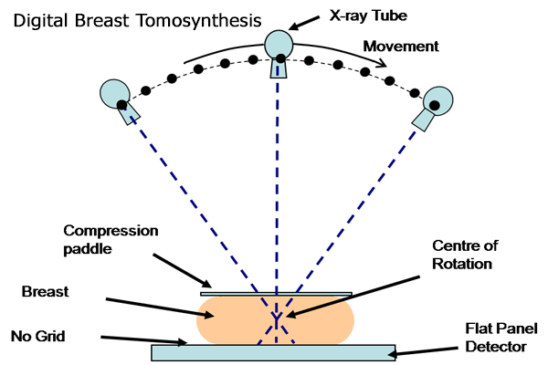

## Quantitative Tomography Analysis ##

__Summary__

Tomosynthesis, tomo, is an medical imaging technique which involves taking multiple
images of an object at different angles.  Imaging at multiple angles provides
enough information such that a 3D rendering of the imaged object can be
reconstructed.  The concept is similar to that of a full CT but with less
images, imaging time, and radiation.  Breast tomosynthesis has proven to be a
useful diagnostic tool for identifying lesions within a patients breast.

  

We have developed an algorithm known as the 3 composition breast, 3CB, which is
able to separate a full field digital mammogram, FFDM, image into the three
major breast components.  The three major breast components include, lipid,
water, and protein.  Invasive breast cancers have a unique lipid, water, and
protein or 3CB signature and our algorithm helps to identify theses invasive
cancers.  This project is focused at adapting the 3CB algorithm to tomo and an
important piece of information is local breast thicknesses.  3CB for FFDM
utilized a calibration object or phantom that was placed in the x-ray field to
help estimate the local breast thickness.  With tomo, we attempt to gain the
local thickness estimations from the multiple images taken at different angles
without a calibration phantom.   

An iterative approach was first implemented to try and estimate the local breast
thickness.  We assumed that a breast under compression maintained a simple
geometrical shape that can be defined by a width, thickness, density, and warp.
Using simulation, we generated virtual breast object, VBO, with different
parameters and then obtained the VBO's resulting sinogram.  Using a root mean
squared error, RMSE, loss function we compared the VBO simulated sinogram to the
real sinogram.  When the RMSE was at the minimum we would assume that the
parameters used to create the VBO are similar to the real imaged breast.
Matching real and simulated sinograms in order to determine the original breast
parameters is an inverse problem.  It turns out that this problem is non-convex
and our iterative algorithm would get stuck in local minima. 

The iterative approach was also computationally expensive and wasteful because a
new VBO would be generated on each iteration.  Dynamic programing technique
such as memoization were not utilized which made the algorithm inefficient.  We
turned to using principal components analysis, PCA, to build a model that can
explain the variance between the geometrical breast parameters and the resulting
sinograms.  Our breast model was able to accurately predict the local breast
thickness down to sub-millimeter resolution.

__Resulting Presentation of Project Work__

- Poster at International Breast Density Workshop (IBDW) 05/2019

- Oral Presentation Radiology Society of North America (RSNA) 12/2019
 
